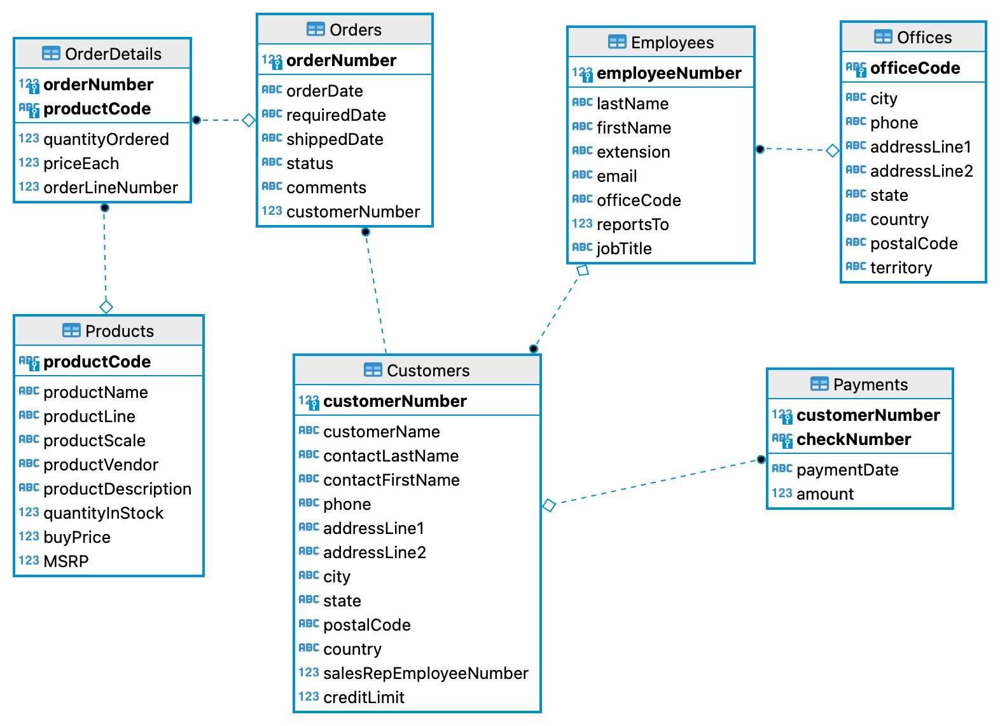

# Migration de données vers ou depuis un environnement NoSQL

# Réflexion sur le passage du modéle relationnel à un modèle à base de documents

A partir du schéma de la base de données suivante *ClassicModel* ci-dessous, vous devez réfléchir à la ré-organisation des données pour les placer dans des **documents** au format JSON, réunis dans une ou plusieurs collections.

Vous devrez donc établir :

- le nombre de collections (chacune contenant idéalement un seul type de documents) ;
- le schéma type des documents à l'intérieur de ces collections ;
- le pseudo-algorithme permettant de passer du modèle relationnel au modèle orienté document.

