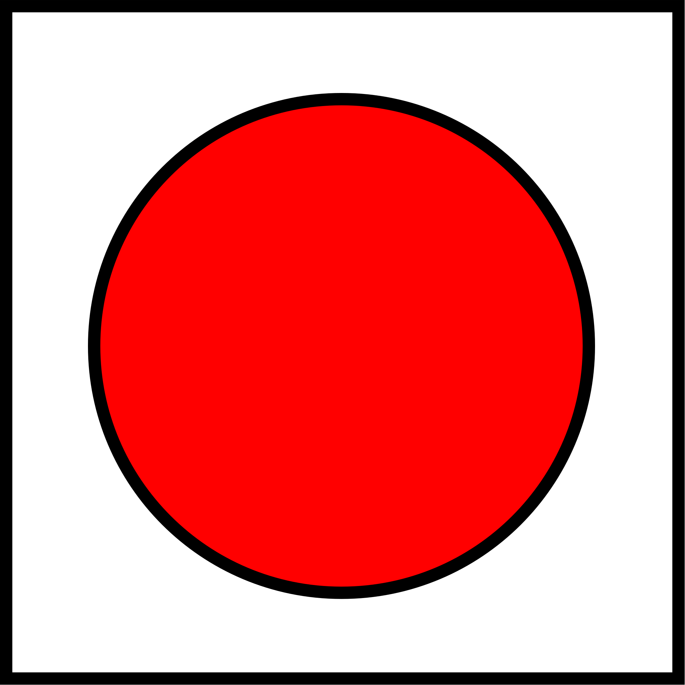
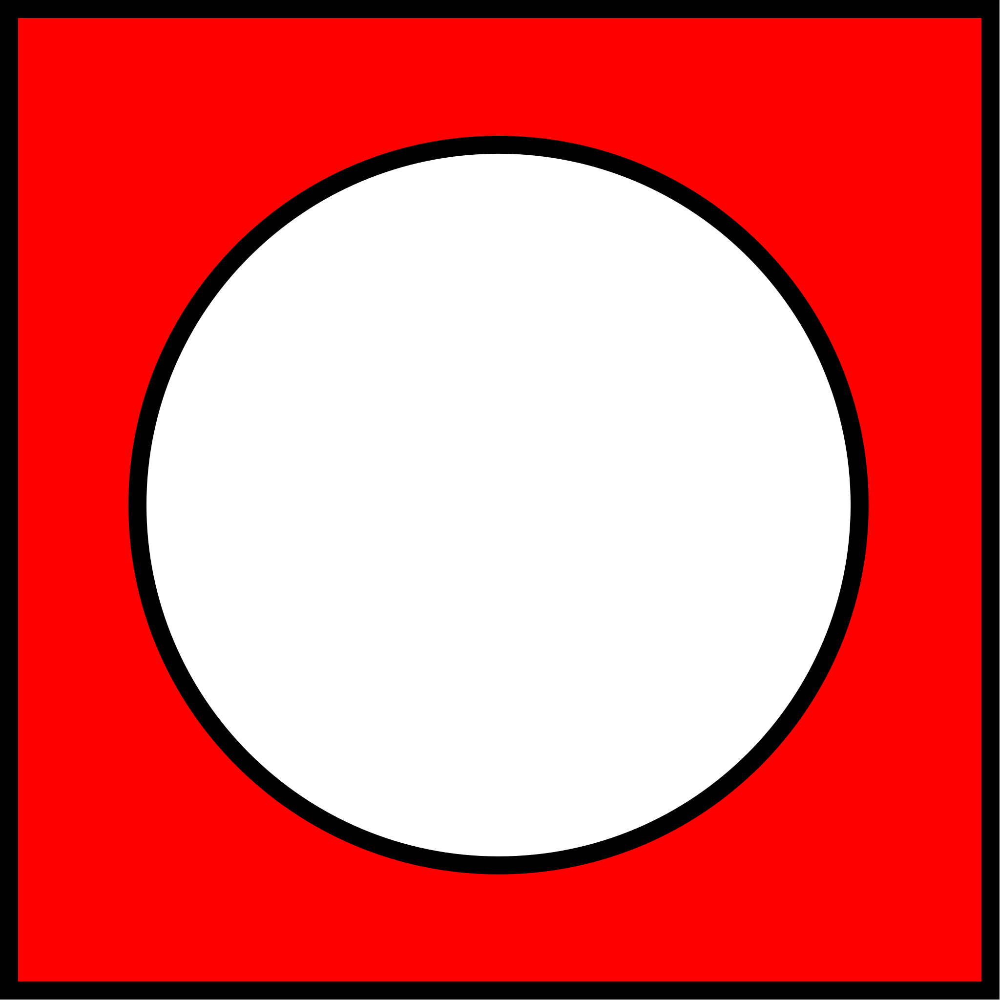
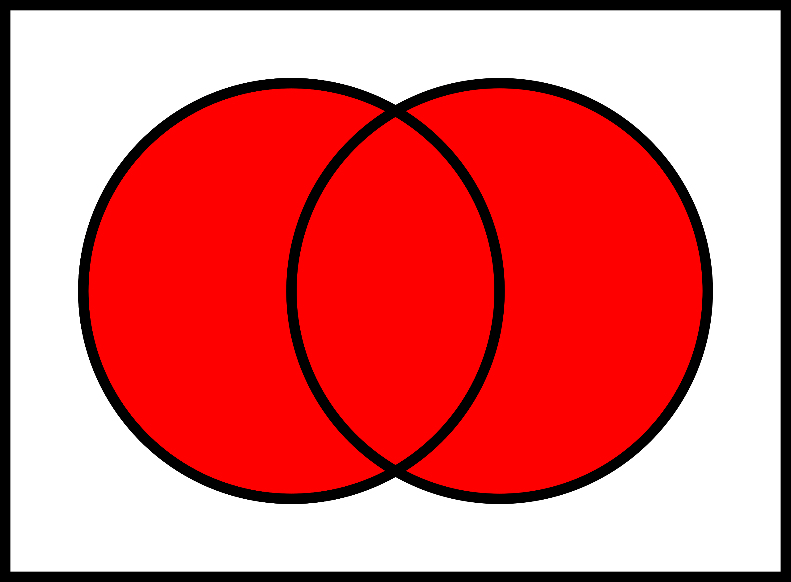
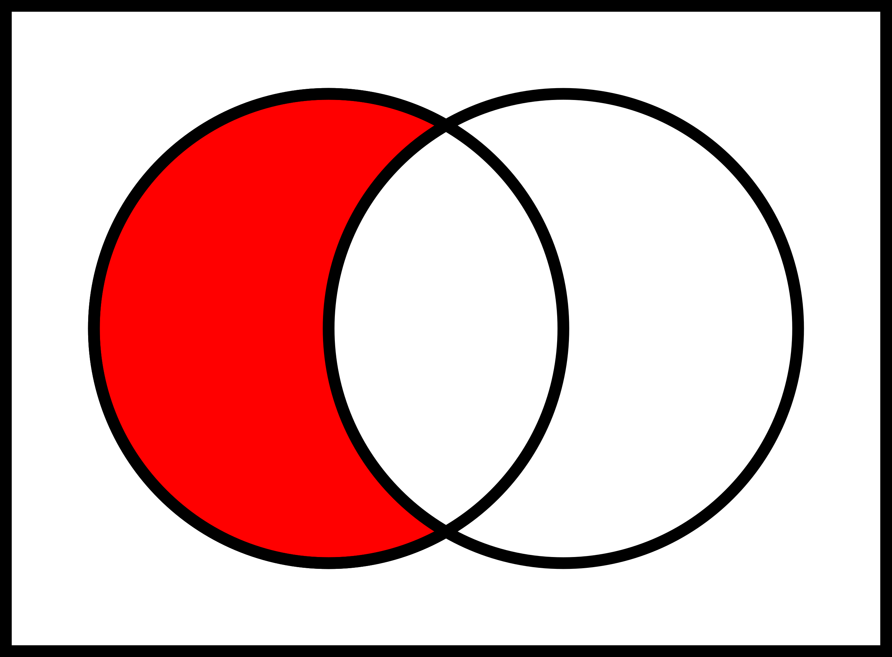
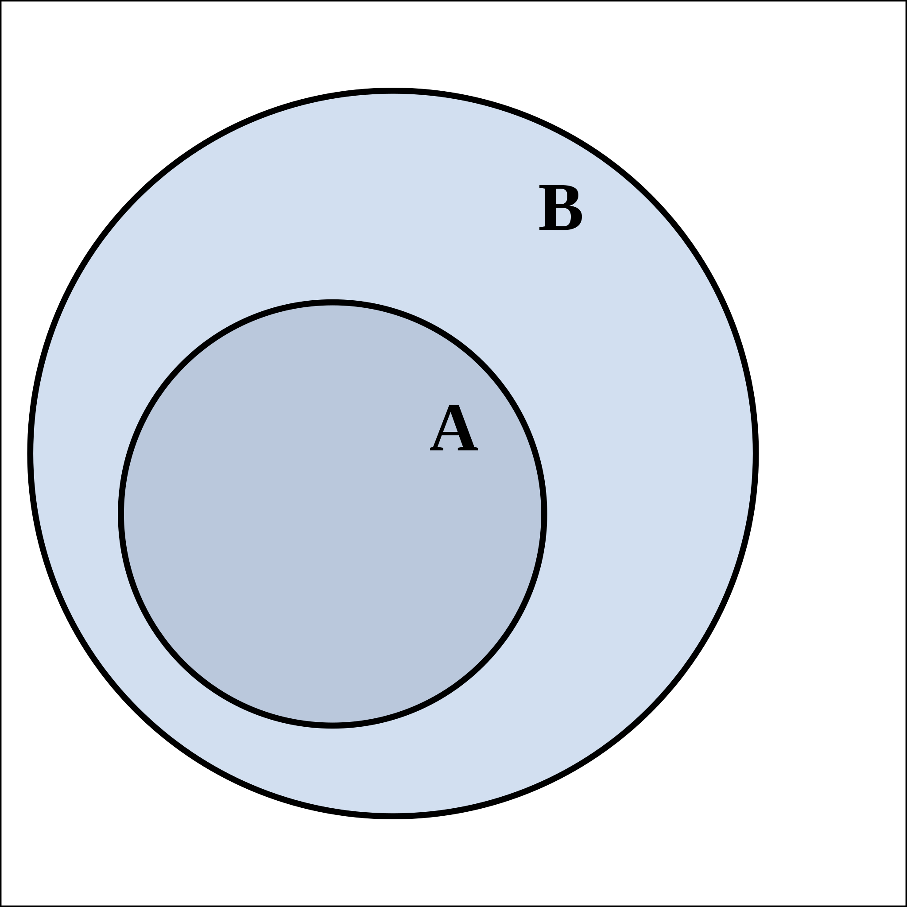
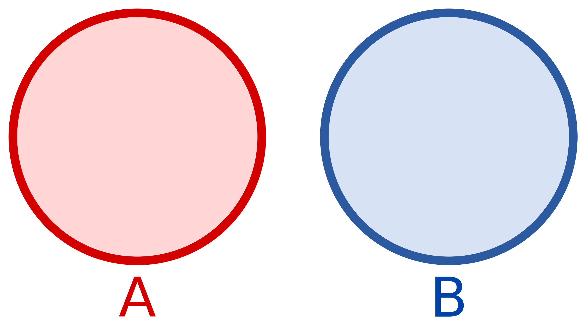

```{r setup, include=FALSE}
knitr::opts_chunk$set(echo = FALSE, warning = FALSE, message = FALSE)
library(tidyverse)
library(knitr)
library(kableExtra)
set.seed(1234)
```

## Rappels de probabilités : Définitions

- **Expérience aléatoire** : expérience dont le résultat ne peut pas être déterminé *a priori*

- **Univers de l'expérience** : ensemble des résultats possibles (noté $\Omega$)

- **Résultat élémentaire** : résultat possible de l'expérience (noté $\omega$)

- **Ensemble des parties** : ensemble constitué de tous les sous-ensembles possibles de $\Omega$ (noté $\mathcal{P}(\Omega)$)

- **Evènement** (aléatoire) : partie (sous-ensemble) de $\Omega$ (noté $A$)
  - On parle de *réalisation* lorsque l'évènement se produit (*i.e* le résultat $\omega$ appartient au sous-ensemble $A$)
  - $A=\Omega$ se réalise toujours
  - $A=\emptyset$ ne se réalise jamais
  - $A=\{\omega\}$ s'appelle donc un évènement élémentaire
  

---

## Exemple simple

Lancer d'un dé à 6 faces (non pipé), avec un jeu où on doit faire un nombre pair

- $\Omega = \{1, 2, 3, 4, 5, 6\}$

- $\mathcal{P}(\Omega)$ : ensemble des 64 sous-ensembles possibles
  - $\emptyset$ et $\Omega$
  - $\{1\}, \{2\}, \ldots$
  - $\{1, 2\}, \{1, 3\}, \ldots$
  - $\{1, 2, 3\}, \{1, 2, 4\}, \ldots$
  - $\ldots$

- $A=\{2, 4, 6\}$

---

## Rappels de probabilités : Evènements 

- $A$ : évènement constitué des éléments de $\Omega$ inclus dans $A$



---

## Rappels de probabilités : Evènements 

- **Complémentaire** de $A$ : évènement constitué des éléments de $\Omega$ non inclus dans $A$
  - $\bar{A} = \{\omega \in \Omega, \omega \notin A \}$



---

## Rappels de probabilités : Evènements 

- **Union** de $A$ et $B$ : évènement constitué des éléments de $A$ et des éléments de $B$ (ou aux deux donc)
  - $A \cup B = \{ w \in \Omega, \omega \in A \mbox{ ou } \omega \in B \}$



---

## Rappels de probabilités : Evènements 

- **Intersection** de $A$ et $B$ : événement constitué des éléments de $\Omega$ étant à la fois dans $A$ et dans $B$
  - $A \cap B = \{ w \in \Omega, \omega \in A \mbox{ et } \omega \in B \}$


---

## Rappels de probabilités : Evènements 

- **Différence** entre $A$ et $B$ (non symétrique) : ensemble constitué des éléments de $A$ n'étant pas dans $B$
  - $A \setminus B = \{ w \in \Omega, \omega \in A \mbox{ et } \omega \notin B \}$



---

## Rappels de probabilités : Evènements 

- **Inclusion** : $A$ est inclus dans $B$ si tous les éléments de $A$ sont dans $B$
  - $A \subset B \Leftrightarrow \left( \omega \in A \implies \omega \in B \right)$



---

## Rappels de probabilités : Evènements 

- **Disjonction** (ou incompatibilité) : $A$ et $B$ sont disjoints s'il n'y aucun élément commun entre les deux
  - $A$ et $B$ disjoints $\Leftrightarrow A \cap B = \emptyset$
  


---

## Rappels de probabilités : Evènements 

### Système complet d'évènements 

$(A_1, A_2, \ldots, A_n)$ constitue un système complet s'ils forment une **partition** de $\Omega$

- Ils sont 2 à 2 incompatibles : $\forall p \ne q, A_p \cap A_q = \emptyset$
- Leur réunion est égale à $\Omega$ : $\bigcup_{p=1}^n A_p = \Omega$

---

## Rappels de probabilités

**Probabilité** : fonction permettant de mesurer la chance (ou le risque) de réalisation d'un évènement

Quelques opérations :

- $P(\emptyset) = 0$ et $P(\Omega)=1$

- $0 \le P(A) \le 1$

- $P(A) = \sum_{\omega_i \in A} P(\omega_i)$

- $P(\bar{A}) = 1 - P(A)$

- $P(A) \le P(B)$ si $A \subset B$

- $P(A \cup B) = P(A) + P(B) - P(A \cap B)$

- $P(\bigcup_i A_i) \le \sum_i P(A_i)$

---

## Rappels de probabilités

- Probabilité conditionnelle de $A$ sachant $B$
$$
  P(A / B) = \frac{P(A \cap B)}{P(B)}
$$

- Indépendance de 2 évènements $A$ et $B$
  - 2 évènements disjoints ne sont pas considérés comme indépendant
  
$$
  P(A \cap B) = P(A) P(B)
$$
$$
  P(A / B) = P(A) 
$$
$$
  P(B / A) = P(B)
$$

- Théorème de Bayes
$$
  P(A / B) = \frac{P(B / A) P(A)}{P(B)}
$$
